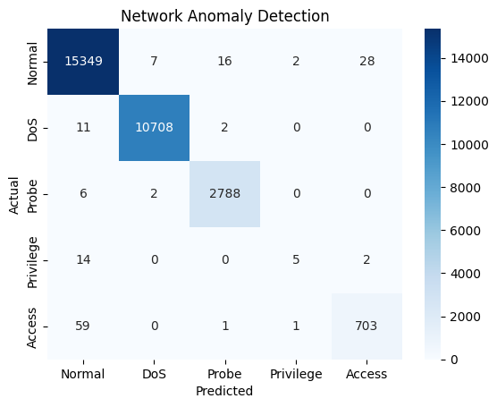

# Network Anomaly Detection

A machine learning-based system for detecting network anomalies and cyber attacks using the NSL-KDD dataset. The system employs a Random Forest Classifier to identify various types of network attacks including DoS (Denial of Service), Probe attacks, Privilege escalation attempts, and unauthorized Access.

## Project Overview

This project implements a multi-class classification model that can identify five different types of network traffic:
1. Normal Traffic
2. DoS (Denial of Service) Attacks
3. Probe Attacks
4. Privilege Escalation Attempts
5. Unauthorized Access

The model achieves high accuracy and precision across all categories, with particularly strong performance in detecting DoS attacks and normal traffic.

## Model Performance

### Validation Set Results
- Accuracy: 99.9%
- Precision: 99.9%
- Recall: 99.9%
- F1-Score: 99.9%


### Test Set Results
- Accuracy: 99.9%
- Precision: 99.9%
- Recall: 99.9%
- F1-Score: 99.9%



## Project Structure

```
├── detector.ipynb          # Main Jupyter notebook containing the model implementation
├── KDD_dataset.txt        # NSL-KDD dataset
├── KDD_dataset.zip        # Compressed dataset
├── network_anomaly_detection_model.joblib  # Saved trained model
├── val_confusion_matrix.png    # Validation set results visualization
└── test_confustion_matrix.png  # Test set results visualization
```

## Requirements

The project requires the following Python packages:
- numpy
- pandas
- scikit-learn
- seaborn
- matplotlib
- joblib

You can install the required packages using:
```bash
pip install numpy pandas scikit-learn seaborn matplotlib joblib
```

## Dataset

The project uses the NSL-KDD dataset, which is an improved version of the original KDD Cup 1999 dataset. The dataset includes various types of network attacks and normal traffic patterns. Features include:
- Basic features (e.g., duration, protocol_type, service)
- Content features (e.g., number of failed logins)
- Traffic features (e.g., same service rate)
- Host-based features (e.g., number of connections to the same host)

## Usage

1. Clone the repository
2. Install the required dependencies
3. Run the Jupyter notebook `detector.ipynb`
4. The trained model is saved as `network_anomaly_detection_model.joblib`

To use the trained model for predictions:

```python
import joblib

# Load the model
model = joblib.load('network_anomaly_detection_model.joblib')

# Make predictions
predictions = model.predict(your_data)
```

## Model Details

The implementation uses a Random Forest Classifier with the following characteristics:
- Multi-class classification (5 classes)
- Feature engineering including one-hot encoding for categorical variables
- Comprehensive evaluation metrics including precision, recall, and F1-score
- Confusion matrix visualization for both validation and test sets

## Performance Analysis

The model shows excellent performance across most categories:
- Near-perfect detection of Normal traffic (99% precision, 100% recall)
- Excellent detection of DoS attacks (100% precision and recall)
- Strong performance in detecting Probe attacks (99% precision, 99-100% recall)
- Good detection of unauthorized Access attempts (96-97% precision, 92% recall)
- Moderate performance on Privilege escalation attacks (lower precision and recall due to limited samples)

## Contributing

Contributions to improve the model's performance or extend its capabilities are welcome. Please feel free to submit pull requests or open issues for discussion.